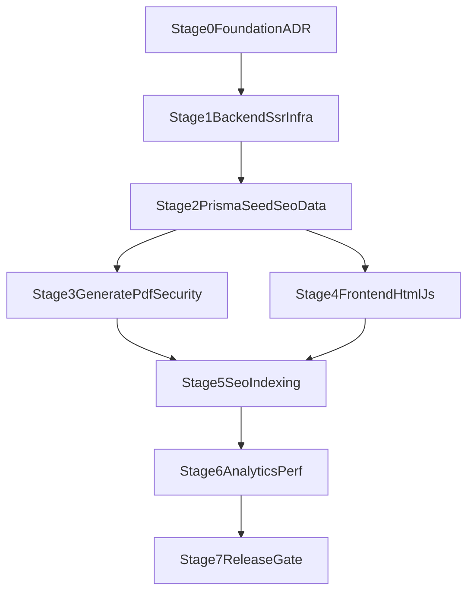

# Альтернативный roadmap DocGenerator (HTML+JS + NestJS + Prisma)

## Ключевые ограничения ТЗ
- Чистый `HTML + JS` допускается только при SSR/SSG-эквиваленте (контент полностью виден без JS).
- Backend: `Node.js + NestJS + Prisma`; PostgreSQL для staging/production, SQLite допустим в development.
- SEO минимум обязателен до релиза: canonical, schema, sitemap, robots, Core Web Vitals, корректная индексация.

## Целевая архитектура
- `apps/api`: NestJS API + server-side HTML rendering + Prisma + SEO endpoints.
- `apps/web-static`: клиентские JS-модули виджета, стили и ассеты.
- `packages/shared`: DTO, Zod-схемы, общие типы.
- Маршруты: `/`, `/:category/`, `/:category/:document/`, `/:category/:document/:variation/`, `/ai-generator/`.

## Этапы и оценки

### Этап 0 — Foundation и ADR (12–16 ч)
- Настроить monorepo (`pnpm`, `turbo`, scripts, configs).
- Зафиксировать ADR: SSR-шаблонизатор, URL policy, canonical policy, rate-limit/session store.
- Подготовить `.env.example`.

### Этап 1 — Backend skeleton + SSR infra (16–22 ч)
- Модули NestJS: `documents`, `templates`, `generate`, `pdf`, `seo`, `analytics`, `health`.
- SSR шаблоны страниц и layout на сервере.
- Кастомная 404 (HTTP 404), gzip/brotli, базовое кеширование.

### Этап 2 — Prisma schema + seed + SEO data (20–28 ч)
- Модели `Category`, `Document`, связи hub/variation.
- Поля SEO и контента: `titleH1`, `metaTitle`, `metaDesc`, `faq`, `published`, `updatedAt`.
- Seed 20 документов MVP + структура под хвосты.
- Валидация data-contract (slug uniqueness, parent-child, category consistency).

### Этап 3 — API core generate/pdf/security (28–36 ч)
- `POST /api/generate` (`filled` + `template`).
- `POST /api/pdf` на Puppeteer + fallback из ТЗ.
- Санитайз, body limit 10KB, whitelist `documentId`.
- Rate-limit: 10/min и 50/hour, ответ 429.
- Интеграционные тесты ключевых сценариев.

### Этап 4 — Frontend HTML+JS UX layer (18–26 ч)
- Модули: `api-client.js`, `document-widget.js`, `preview.js`, `download-modal.js`, `metrika.js`.
- Реализовать `DocumentWidget`, `DocumentPreview`, `DownloadModal`, `FaqBlock`, `Breadcrumbs`.
- Mobile-first: widget above the fold, `font-size >= 16px`, tap target >= 48px.

### Этап 5 — SEO и индексация (24–32 ч)
- Metadata: уникальные title/description/H1 с `{year}`, canonical.
- Schema:
  - Home: `WebSite + SearchAction + SoftwareApplication`.
  - Category: `BreadcrumbList + ItemList`.
  - Document/variation: `BreadcrumbList + FAQPage + HowTo`.
- `robots.txt`: disallow `/api/`, `/admin/`, `/cabinet/`, `/*?sort=`, `/*?utm_`, `/*?ref=`.
- `sitemap.xml`: только `published`, `lastmod` из `updatedAt`.
- Проверка рендера без JS на всех SEO-страницах.

### Этап 6 — Аналитика, perf, наблюдаемость (14–20 ч)
- Яндекс Метрика: 10 событий из ТЗ.
- Sentry, structured logs, `/api/health`, privacy/cookie notice.
- LCP/Core Web Vitals оптимизации (preload шрифтов, async/defer scripts, WebP).

### Этап 7 — Release gate и запуск волнами (10–14 ч)
- Green pipeline: lint, typecheck, build, test.
- SEO acceptance: Rich Results, canonical/robots/sitemap/404.
- Публикация:
  - Неделя 1–2: P0 (главная, категории, `/ai-generator/`, SEO infra).
  - Неделя 3–4: P1 (хабы + первые вариации).
- README и деплой runbook.

## Таблица оценок по этапам
| Этап      | Содержание                       | Оценка, ч   |
| --------- | -------------------------------- | ----------- |
| 0         | Foundation и ADR                 | 12–16       |
| 1         | Backend skeleton + SSR infra     | 16–22       |
| 2         | Prisma schema + seed + SEO data  | 20–28       |
| 3         | API core (generate/pdf/security) | 28–36       |
| 4         | Frontend HTML+JS UX layer        | 18–26       |
| 5         | SEO и индексация                 | 24–32       |
| 6         | Аналитика, perf, наблюдаемость   | 14–20       |
| 7         | Release gate и запуск волнами    | 10–14       |
| **Итого** | **Последовательная реализация**  | **156–214** |

## Суммарная оценка
- Backend + DB + API + security: **76–102 ч**
- Frontend HTML+JS UX: **32–46 ч**
- SEO + analytics + perf + release: **48–66 ч**
- Итого: **156–214 ч**

## Почему разброс 156–214 часов
- Разница в **58 часов** связана не с неопределенностью в базовых задачах, а с диапазоном сценариев реализации (MVP-база vs усиленная production-подготовка).
- Главные источники разброса:
  - **SSR и шаблонизатор в NestJS (Э1)**: простая шаблонная архитектура или более строгая компонентная декомпозиция и кеширование.
  - **Данные и SEO-контент (Э2, Э5)**: объем ручной валидации метаданных, FAQ, перелинковки, а также глубина подготовки вариаций под длинный хвост.
  - **PDF и инфраструктурные ограничения (Э3)**: скорость интеграции Puppeteer и необходимость fallback-варианта.
  - **Качество UX на чистом JS (Э4)**: количество доработок после мобильных проверок и UX-итераций без фронтенд-фреймворка.
  - **Финальные проверки (Э6, Э7)**: объем исправлений по Lighthouse/Rich Results/вебмастеру после первого прогона.
- Практическая интерпретация:
  - **156–176 ч** — если инфраструктура и контент подготовлены заранее, минимум итераций.
  - **177–196 ч** — реалистичный базовый сценарий для команды без блокеров.
  - **197–214 ч** — если появляются доработки SEO, PDF fallback и дополнительные правки контента/UX перед релизом.

## Календарь
- 1 разработчик: **4.5–6.5 недель**
- 2 разработчика (параллель после Э2): **3.5–5 недель**
- Буфер на контент/юридические правки: **+15%**

## Критический путь

## SEO-ворота качества
- После Э1: сервер отдает валидный HTML, 404 корректный.
- После Э2: заполнены SEO-поля и статусы публикации.
- После Э5: валидные schema, canonical, robots, sitemap; контент доступен без JS.
- После Э7: sitemap загружен в Яндекс Вебмастер, критичных SEO-ошибок нет.
