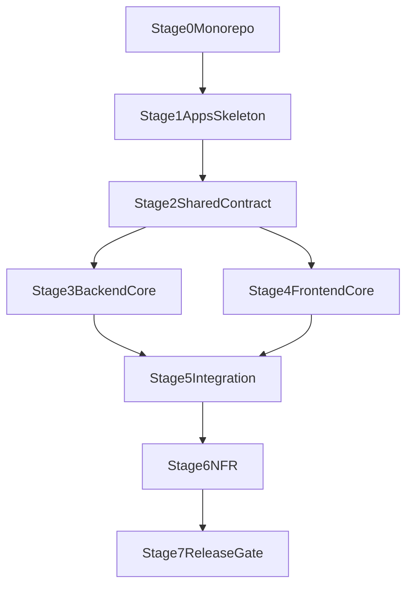

# Master Roadmap — DocGenerator MVP (Monorepo)

## Цель
Свести frontend и backend планы в единый исполняемый маршрут для monorepo (`pnpm workspaces + turbo`) с прозрачной последовательностью внедрения, минимальными блокировками между командами и едиными quality-gates.

## Источники консолидации
- [docgenerator-frontend-implementation_55da44f8.plan.md](.cursor/plans/docgenerator-frontend-implementation_55da44f8.plan.md)
- [docgenerator-frontend-step-by-step-estimate_62870420.plan.md](.cursor/plans/docgenerator-frontend-step-by-step-estimate_62870420.plan.md)
- [docgenerator-backend-implementation_cb110c53.plan.md](.cursor/plans/docgenerator-backend-implementation_cb110c53.plan.md)
- [docgenerator-backend-step-by-step-estimate_2bdb7f9b.plan.md](.cursor/plans/docgenerator-backend-step-by-step-estimate_2bdb7f9b.plan.md)

## Целевая структура репозитория
- `apps/web` — Next.js App Router frontend (FSD внутри `src`)
- `apps/api` — backend API (Prisma + generate/pdf endpoints)
- `packages/shared` — типы, схемы, константы и общий контракт
- `packages/config` — lint/typecheck/format presets

## Суммарная оценка
- Frontend (обновленный план): **84–100ч**
- Backend (обновленный план): **77–90ч**
- Общий объем (без учета параллелизма): **161–190ч**
- Реалистичный календарный срок при параллельной работе потоков: **95–120ч** (примерно 12–15 рабочих дней)

## Единая последовательность внедрения

### Этап 0. Foundation монорепозитория (12–16ч)
- Настроить `pnpm-workspace.yaml`, root `package.json`, `turbo.json`.
- Подключить pipeline задач: `dev`, `lint`, `typecheck`, `build`, `test`.
- Создать `packages/config` и `packages/shared` (публичные API пакетов).
- Настроить правила кэширования и dependency graph для turbo.

Результат:
- Базовая платформа для одновременной разработки web/api без дублирования конфигов.

---

### Этап 1. Скелет приложений и архитектурные границы (10–12ч)
- Поднять `apps/web` и `apps/api`.
- В `apps/web` зафиксировать FSD-структуру: `app/pages/widgets/features/entities/shared`.
- В `apps/api` зафиксировать server-модули: `env/db/templates/ai/pdf/session/rate-limit`.
- Подключить shared конфиги (`packages/config`) в оба приложения.

Результат:
- Оба приложения стартуют в monorepo, границы ответственности зафиксированы.

---

### Этап 2. Shared-контракт данных и моделирование домена (14–18ч)
- Описать `DocumentData`, `Category`, `FormField`, `FaqItem` в `packages/shared`.
- Подключить эти типы в `apps/web` и `apps/api` (без локального дублирования).
- На backend: спроектировать Prisma-модель с `parentId` self-relation.
- На frontend: подготовить mock-repositories и JSON валидацию под shared-контракт.

Результат:
- Единый источник правды для контракта между web и api.

---

### Этап 3. Core Backend поток (26–30ч)
- Реализовать Prisma миграции и seed (категории -> hubs -> variations).
- Реализовать `templates` service (`getDocument`, `getVariation`, `getAllDocuments`, `getCategoryHubs`).
- Реализовать `POST /api/generate` (`filled` + `template`) с Zod, sanitize, session-store.
- Реализовать `POST /api/pdf` с дисклеймером и dev fallback.

Результат:
- Backend отдает стабильный контракт для полного пользовательского сценария.

Зависимости:
- Требует завершения этапа 2.

---

### Этап 4. Core Frontend поток (32–38ч)
- Реализовать App Router маршруты: `/`, `/[category]`, `/[category]/[document]`, `/[category]/[document]/[variation]`, `/ai-generator`, `not-found`.
- Реализовать ключевые widgets/features:
  - DocumentWidget flow (`filled/template`)
  - DocumentPreview (blur + copy)
  - DownloadModal
  - TrustBadge, LeadParagraph, RelatedDocs
- Проверить widget-first UX на mobile.

Результат:
- Готов пользовательский UI-флоу до интеграции с реальным backend.

Зависимости:
- Требует завершения этапа 2.

---

### Этап 5. Интеграция web/api (12–16ч)
- Перевести `apps/web` с mock на `http-repository` к `apps/api`.
- Проверить соответствие runtime-ответов shared-контракту.
- Зафиксировать обработку ошибок `400/404/429/500` на UI.
- Пройти smoke сценарии: generate filled/template, pdf download, error states.

Результат:
- Полноценный end-to-end поток без архитектурного долга.

Зависимости:
- Требует завершения этапов 3 и 4.

---

### Этап 6. Нефункциональные требования (16–20ч)
- Frontend SEO: metadata, canonical, sitemap, robots, JSON-LD (`FAQPage`, `HowTo`, `BreadcrumbList`, `SoftwareApplication`, `WebSite/SearchAction`).
- Backend security/ops: rate limiting, `/api/health`, structured logging, Sentry.
- Убедиться, что `updatedAt/published` корректно участвуют в sitemap/индексации.

Результат:
- Готовность к staging и SEO-проверкам.

Зависимости:
- Требует этапа 5 (часть задач можно делать параллельно с концом этапа 5).

---

### Этап 7. Release Gate (8–10ч)
- Прогнать общий pipeline: `pnpm turbo run lint typecheck build`.
- Выполнить E2E smoke checklist.
- Проверить performance (LCP), JS-disabled rendering, schema validation.
- Закрыть MVP checklist и оформить release notes.

Результат:
- Репозиторий готов к релизу MVP.

## Критический путь
`Этап 0 -> Этап 1 -> Этап 2 -> (Этап 3 || Этап 4) -> Этап 5 -> Этап 6 -> Этап 7`

## План параллелизма
- После Этапа 2 запускаются два независимых потока:
  - Backend поток: Этап 3
  - Frontend поток: Этап 4
- Это основной источник экономии календарного времени.

## Mermaid-схема зависимостей

## Контрольные ворота качества
- После Этапа 2: shared-контракт стабилен и импортируется из `packages/shared`.
- После Этапов 3/4: оба потока проходят `typecheck` и локальные smoke тесты.
- После Этапа 5: end-to-end генерация и PDF работают на staging.
- После Этапа 7: pipeline green, SEO/Schema валидны, MVP checklist закрыт.

## Риски
- Monorepo bootstrap и конфигурационный drift (`turbo`, workspaces, shared-versioning).
- Совместимость Puppeteer в целевой среде.
- Расхождения между seed-данными и frontend-ожиданиями.
- Ошибки интеграции в момент переключения `mock -> http`.

## Definition of Done (Master)
- Frontend и backend работают как единая система в monorepo.
- Контракт централизован в `packages/shared` и не дублируется.
- Роутинг/SEO/Schema/UX и API/security/observability закрыты по MVP.
- `pnpm turbo run lint typecheck build` стабильно проходит для всего репозитория.
