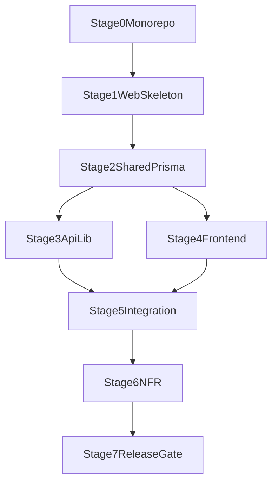

# Master Roadmap — DocGenerator MVP (ТЗ v1.0 + Monorepo)

## Нормативная база
- **ТЗ v1.0** — единственный источник требований к MVP (воронка PDF Commander, SEO, API, аналитика, безопасность, критерии сдачи).
- Связанные материалы: SEO-структура, UX-спецификация (вне репозитория).
- Дорожная карта ниже **не расширяет** объём MVP из ТЗ §14.

## Цель продукта (ТЗ §1)
Маркетинговый сервис: органический трафик из Яндекса → бесплатная генерация документа → при скачивании CTA на PDF Commander. Разработка сглаживает путь от поиска до установки программы.

### Метрики успеха MVP (ТЗ §1)
| Метрика | Цель | Где |
|--------|------|-----|
| Страниц в индексе (≈4 нед.) | 50+ | Яндекс Вебмастер |
| LCP | ≤ 2.5 с на мобильном | PageSpeed Insights |
| Доля генерирующих | ≥ 35% трафика | Метрика, цель `doc_generated` |
| Клик CTA PDF Commander | ≥ 20% от генерирующих | Метрика, цель `cta_click` |
| Ошибки генерации | < 2% запросов | Серверные логи |

## Источники планирования (наследие)
- [docgenerator-frontend-implementation_55da44f8.plan.md](.cursor/plans/docgenerator-frontend-implementation_55da44f8.plan.md)
- [docgenerator-frontend-step-by-step-estimate_62870420.plan.md](.cursor/plans/docgenerator-frontend-step-by-step-estimate_62870420.plan.md)
- [docgenerator-backend-implementation_cb110c53.plan.md](.cursor/plans/docgenerator-backend-implementation_cb110c53.plan.md)
- [docgenerator-backend-step-by-step-estimate_2bdb7f9b.plan.md](.cursor/plans/docgenerator-backend-step-by-step-estimate_2bdb7f9b.plan.md)

При конфликте с **ТЗ v1.0** приоритет у ТЗ.

## Целевая структура репозитория (ТЗ §3.1 + общий код)
Монорепозиторий нужен для общих типов и конфигов; **публичное API по ТЗ** живёт в одном Next-приложении.

- `apps/web` — Next.js 14+ (App Router): страницы, **`src/app/api/generate/route.ts`**, **`src/app/api/pdf/route.ts`**, `src/lib/` (ai, pdf, templates, schema), `prisma/`, FSD внутри `src`.
- `packages/shared` — типы, Zod-схемы, константы, общий контракт запросов/ответов API и форм.
- `packages/config` — пресеты eslint/prettier/tsconfig для web (и пакетов).

Отдельный сервис `apps/api` **не требуется ТЗ**: границы модулей внутри `apps/web` повторяют ТЗ (`env`, `db`, `templates`, `ai`, `pdf`, `session`, `rate-limit`).

## Технологический стек (ТЗ §2)
- Next.js App Router (SSR/SSG), TypeScript, Tailwind.
- Anthropic Claude API (`claude-haiku-4-5`, подстановка в `templateBody`, ТЗ §4.3); в режиме `template` ИИ **не** вызывается (ТЗ §4.4).
- PDF: Puppeteer (HTML → PDF), оформление и дисклеймер ТЗ §7; **development** — мок PDF без Puppeteer (ТЗ §12).
- БД: **production/staging** — PostgreSQL + Prisma; **development** — SQLite через Prisma (ТЗ §12).
- Аналитика: Яндекс.Метрика (ТЗ §9–10).
- Ошибки и наблюдаемость в MVP: структурные серверные логи + алерты платформы хостинга.
- Sentry: отложено на post-MVP (после запуска, при появлении аккаунта и регламента алертинга).
- Альтернативы PDF при недоступности Puppeteer на хостинге: ТЗ §2.1 (`@react-pdf/renderer`, `pdf-lib`, отдельный WeasyPrint) — зафиксировать выбор при срыве сроков/инфры.

## Суммарная оценка по этапам (чел.-часы)

| Этап | Содержание | Часы (мин–макс) |
|------|------------|-----------------|
| 0 | Foundation monorepo | 12–16 |
| 1 | Скелет `apps/web` | 10–12 |
| 2 | Shared + Prisma + seed | 14–18 |
| 3 | Backend в `apps/web` (generate, pdf, сессии) | 26–30 |
| 4 | Frontend (страницы, виджеты) | 32–38 |
| 5 | Интеграция БД + same-origin API | 12–16 |
| 6 | SEO, rate limit, Sentry, Метрика | 16–20 |
| 7 | Release gate, README, деплой | 8–10 |
| **Итого, если делать всё подряд одним потоком** | | **130–160** |

**Критический путь при параллели** (после этапа 2 этапы 3 и 4 ведутся одновременно):  
`0 + 1 + 2 + max(3, 4) + 5 + 6 + 7` → **104–130 ч** (≈ **13–16** рабочих дней при 8 ч/день на команду в сумме по критическому пути; фактически нужны **два параллельных исполнителя** на этапах 3–4 или сдвиг сроков).

**Календарь (ориентир для планирования)**

- **Один middle+/senior full-time, последовательно:** **130–160 ч** → **~16–20 рабочих дней** (≈ **3,5–4,5 недели** при 8 ч/день), без буфера на правки контента и инфраструктуру.
- **Два разработчика с разделением backend/frontend после этапа 2:** критический путь **104–130 ч** → **~13–16 рабочих дней** (≈ **2,5–3,5 недели**) плюс буфер на ревью, Puppeteer/хостинг, юридическую вычитку 20 документов.
- **Срок MVP в ТЗ:** **4–6 недель** — согласуется с оценкой, если заложить буфер, непредвиденные правки SEO/хостинга и время на настройку Метрики/Вебмастера.

Наследуемые планы (раздельный frontend/backend) давали **161–190 ч** суммарно и **≈95–120 ч** календарных при сильной параллели; после объединения в `apps/web` пересчёт по этапам выше — основной ориентир для дорожной карты.

## Деплой и окружения (ТЗ §12)
| Окружение | Назначение | Конфигурация |
|-----------|------------|----------------|
| development | Локальная разработка | SQLite (Prisma), моковый PDF без Puppeteer |
| staging | Предрелиз | PostgreSQL, Puppeteer, тестовый Anthropic key |
| production | Прод | PostgreSQL, Puppeteer, продовый Anthropic key, Яндекс.Метрика |

Переменные окружения — ТЗ §12.1 (`DATABASE_URL`, `ANTHROPIC_API_KEY`, `NEXT_PUBLIC_*`, Upstash для rate limit, `SENTRY_DSN`, `NEXT_PUBLIC_YANDEX_METRIKA_ID`).

## Данные и маршрутизация (ТЗ §3.2–§5)
- Prisma: модели **Category** и **Document** как в ТЗ §3.2 (`formFields`, `faq` Json, `relatedIds`, `published`, приоритеты и т.д.).
- Публичные URL документов MVP: **`/[category]/[document]/`** (ТЗ §3.1, §5.3). Без обязательного третьего сегмента «вариация» в объёме MVP.
- Seed: **ровно 20 документов** из ТЗ §8 (категории и slug как в таблице); публикация через `published: true` после юридической/HR проверки (ТЗ §8).

## API (ТЗ §4)
- `POST /api/generate` — тело, ответ и `sessionId` по ТЗ §4.1; режимы `filled` | `template`.
- `POST /api/pdf` — `sessionId`, `mode`; ответ `application/pdf`, `Content-Disposition` (ТЗ §4.2).
- Валидация и sanitize: ТЗ §11.2 (HTML-стрип, **до 500 символов** на поле, **тело ≤ 10 КБ**, `documentId` только из белого списка БД).

## Rate limiting (ТЗ §11.1)
- **10** запросов к `/api/generate` с IP в минуту, **50** в час; ответ **429** с текстом из ТЗ.
- Реализация: Upstash Redis + `@upstash/ratelimit` (или эквивалент с теми же лимитами).

## Ключевые UI-компоненты (ТЗ §6)
- `DocumentWidget` — режимы, шаги, требования §6.1 (в т.ч. сохранение полей при смене режима, приватность, автофокус).
- `DocumentPreview` — размытие нижней части, полный текст при копировании, CTA и тост §6.2.
- `DownloadModal` — структура и **две** рабочие кнопки (программа + PDF без программы) §6.3.
- `FaqBlock` + `Breadcrumbs` — разметка и JSON-LD §6.4, §5.4.
- Дисклеймер на страницах — ТЗ §11.3.

## Яндекс.Метрика — события MVP (ТЗ §10)
До запуска настроить цели и отправку с фронта: `mode_selected`, `form_start`, `doc_generated`, `generate_error`, `cta_click`, `modal_open`, `download_app`, `download_pdf_only`, `modal_close`, `copy_text` (параметры — как в таблице ТЗ).

## Единая последовательность внедрения

### Этап 0. Foundation монорепозитория (12–16ч)
- `pnpm-workspace.yaml`, root `package.json`, `turbo.json`, задачи `dev`, `lint`, `typecheck`, `build`, `test`.
- `packages/config`, `packages/shared`, кэширование turbo.

Результат: основа для `apps/web` и общих пакетов.

---

### Этап 1. Скелет `apps/web` (10–12ч)
- Next.js App Router, FSD: `app/`, `widgets/`, `features/`, `entities/`, `shared/`.
- Каталоги `src/lib/`, `prisma/`, заготовки `app/api/generate/route.ts`, `app/api/pdf/route.ts`.
- Подключение `packages/config` / `packages/shared`.

Результат: приложение стартует, структура соответствует ТЗ §3.1.

---

### Этап 2. Shared-контракт и Prisma (14–18ч)
- В `packages/shared`: типы полей формы, FAQ, DTO для generate/pdf, Zod-схемы.
- `schema.prisma` по ТЗ §3.2; миграции под **SQLite (dev)** и **PostgreSQL (staging/prod)** или единая схема с переключением `provider` по env.
- JSON seed из `data/documents/` (или аналог) → загрузка в БД; контракт страниц = данные из Prisma.

Результат: одна модель данных, совместимая с ТЗ и SEO-полями.

---

### Этап 3. Core backend в `apps/web` (26–30ч)
- Сервис шаблонов: выбор документа по белому списку, `templateBody`, `legalBasis`, поля формы.
- `POST /api/generate`: ИИ только для `filled` (ТЗ §4.3), `template` без Anthropic; session-store для PDF.
- `POST /api/pdf`: Puppeteer по ТЗ §7 на **staging/prod**; на **development** — мок-буфер PDF без запуска браузера (ТЗ §12).
- Дисклеймер в PDF — ТЗ §7.2.

Результат: контракт API как в ТЗ §4.

Зависимости: этап 2.

---

### Этап 4. Core frontend (32–38ч)
- Маршруты: `/`, `/[category]/`, `/[category]/[document]/`, `/ai-generator/`, `not-found`; главная и категории — требования ТЗ §5.1–§5.2.
- Страница документа: **порядок блоков** строго как ТЗ §5.3; `generateStaticParams` / `generateMetadata`, canonical, OG.
- Виджеты: §6; мобильный приоритет виджета до первого скролла; `text-base` на инпутах (ТЗ §9).

Результат: полный UX-флоу на mock или статических данных до полной подстановки Prisma.

Зависимости: этап 2.

---

### Этап 5. Интеграция данных и API (12–16ч)
- Заменить mock-репозитории на чтение из БД; клиентские запросы на **same-origin** `/api/generate`, `/api/pdf`.
- Обработка **400 / 404 / 429 / 500** на UI (ТЗ §13).
- Smoke: filled + template, скачивание PDF, ошибки.

Результат: сквозной сценарий как в критериях сдачи ТЗ §13.

Зависимости: этапы 3 и 4.

---

### Этап 6. Нефункциональные требования (16–20ч)
- SEO: `sitemap.ts`, `robots.ts` (закрыть `/api/`), JSON-LD: `WebSite` + `SearchAction`, `ItemList`, `BreadcrumbList`, `FAQPage` и пр. по ТЗ §5.4 и §9.
- Rate limiting по числам ТЗ §11.1; `/api/health`; структурные логи; алерты хостинга.
- Яндекс.Метрика: счётчик в layout + события §10; на **production** обязательна до релиза (ТЗ §2, §9).
- `updatedAt` / `published` в sitemap (ТЗ §9).
- Sentry вынесен в post-MVP backlog (отдельная задача внедрения).

Результат: готовность к staging и продакшен-чеклисту.

Зависимости: этап 5 (частично можно параллелить с концом этапа 5).

---

### Этап 7. Release Gate (8–10ч)
- `pnpm turbo run lint typecheck build` — зелёный pipeline.
- Проверка **критериев сдачи ТЗ §13** (функциональность, SEO, производительность LCP, аналитика, отсутствие ошибок в консоли).
- README: локальный запуск, добавление документа в БД; инструкция деплоя (ТЗ §13).
- Release notes.

Результат: MVP принят по ТЗ.

## Критический путь
`Этап 0 → 1 → 2 → (Этап 3 || Этап 4) → Этап 5 → Этап 6 → Этап 7`

## План параллелизма
- После этапа 2: поток A — API, Prisma seed из 20 документов, generate/pdf; поток B — страницы и виджеты (на фикстурах с последующей заменой на БД).

## Mermaid-схема зависимостей

## Контрольные ворота качества
- После этапа 2: контракт в `packages/shared`, Prisma соответствует ТЗ §3.2.
- После этапов 3/4: typecheck; локальные smoke на dev (мок PDF).
- После этапа 5: E2E на staging (PostgreSQL + Puppeteer).
- После этапа 7: выполнен чеклист ТЗ §13, Метрика проверена отладчиком.

## Риски
- Monorepo и drift конфигов (`turbo`, workspaces).
- Puppeteer на целевом хостинге (Vercel/Railway) — план Б по ТЗ §2.1.
- Качество и юридическая проверка **20** шаблонов (ТЗ §8).
- Стабильность интеграции Anthropic и лимитов по стоимости.
- Отсутствие Sentry в MVP может увеличить время реакции на edge-case ошибки; компенсируется логами и алертами хостинга.

## Definition of Done (Master = ТЗ §13)
- Опубликованы **все 20** документов из ТЗ §8 с валидными URL.
- Режимы filled/template, модалка с **двумя** кнопками скачивания, копирование с тостом, rate limit **429** на 11-м запросе в минуту.
- SEO: sitemap, robots, уникальные title/canonical, валидные FAQ и Breadcrumb schema, контент без JS.
- LCP ≤ 2.5 с (моб.), нет лишних ошибок в консоли.
- Все **10** событий Метрики из ТЗ §10 настроены и проверены.
- `pnpm turbo run lint typecheck build` стабильно проходит; README и деплой описаны.
