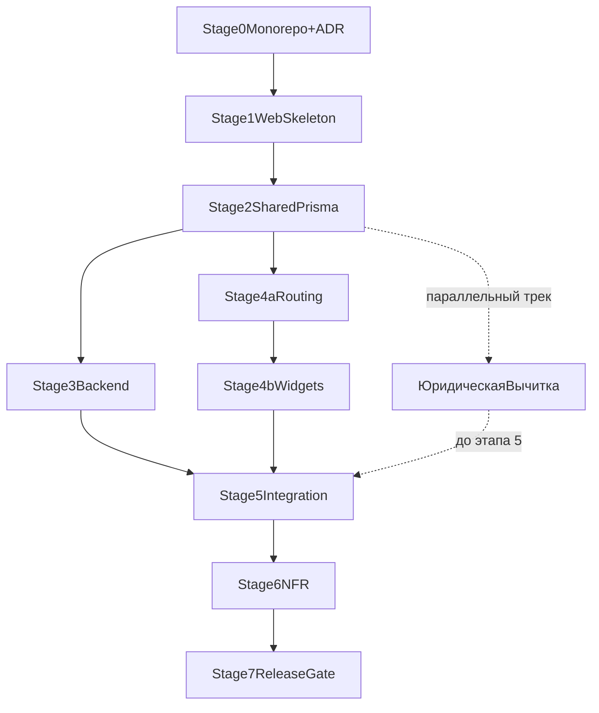

# Master Roadmap — DocGenerator MVP (ТЗ v1.0 + Monorepo)

## Нормативная база
- **ТЗ v1.0** — единственный источник требований к MVP (воронка PDF Commander, SEO, API, аналитика, безопасность, критерии сдачи).
- Связанные материалы: SEO-структура, UX-спецификация (вне репозитория).
- Дорожная карта ниже **не расширяет** объём MVP из ТЗ §14.

## Цель продукта (ТЗ §1)
Маркетинговый сервис: органический трафик из Яндекса → бесплатная генерация документа → при скачивании CTA на PDF Commander. Разработка сглаживает путь от поиска до установки программы.

### Метрики успеха MVP (ТЗ §1)
| Метрика | Цель | Где |
|--------|------|-----|
| Страниц в индексе (≈4 нед.) | 50+ | Яндекс Вебмастер |
| LCP | ≤ 2.5 с на мобильном | PageSpeed Insights |
| Доля генерирующих | ≥ 35% трафика | Метрика, цель `doc_generated` |
| Клик CTA PDF Commander | ≥ 20% от генерирующих | Метрика, цель `cta_click` |
| Ошибки генерации | < 2% запросов | Серверные логи |

> **Реалистичность**: метрики 35% генерирующих и 20% CTA-кликов — **амбициозные** цели без A/B-тестирования. Принять как ориентир для итераций после запуска, не как критерий сдачи MVP. Критерием сдачи остаётся ТЗ §13 (функциональность, технические параметры).

## Источники планирования (наследие)
- [docgenerator-frontend-implementation_55da44f8.plan.md](.cursor/plans/docgenerator-frontend-implementation_55da44f8.plan.md)
- [docgenerator-frontend-step-by-step-estimate_62870420.plan.md](.cursor/plans/docgenerator-frontend-step-by-step-estimate_62870420.plan.md)
- [docgenerator-backend-implementation_cb110c53.plan.md](.cursor/plans/docgenerator-backend-implementation_cb110c53.plan.md)
- [docgenerator-backend-step-by-step-estimate_2bdb7f9b.plan.md](.cursor/plans/docgenerator-backend-step-by-step-estimate_2bdb7f9b.plan.md)

При конфликте с **ТЗ v1.0** приоритет у ТЗ.

## Целевая структура репозитория (ТЗ §3.1 + общий код)
Монорепозиторий нужен для общих типов и конфигов; **публичное API по ТЗ** живёт в одном Next-приложении.

- `apps/web` — Next.js 14+ (App Router): страницы, **`src/app/api/generate/route.ts`**, **`src/app/api/pdf/route.ts`**, `src/lib/` (ai, pdf, templates, schema), `prisma/`, FSD внутри `src`.
- `packages/shared` — типы, Zod-схемы, константы, общий контракт запросов/ответов API и форм.
- `packages/config` — пресеты eslint/prettier/tsconfig для web (и пакетов).

Отдельный сервис `apps/api` **не требуется ТЗ**: границы модулей внутри `apps/web` повторяют ТЗ (`env`, `db`, `templates`, `ai`, `pdf`, `session`, `rate-limit`).

## Технологический стек (ТЗ §2)
- Next.js App Router (SSR/SSG), TypeScript, Tailwind.
- Anthropic Claude API (`claude-haiku-4-5-20251001`, подстановка в `templateBody`, ТЗ §4.3); в режиме `template` ИИ **не** вызывается (ТЗ §4.4).
- PDF: Puppeteer (HTML → PDF), оформление и дисклеймер ТЗ §7; **development** — мок PDF без Puppeteer (ТЗ §12).
- БД: **production/staging** — PostgreSQL + Prisma; **development** — SQLite через Prisma (ТЗ §12).
- Аналитика: Яндекс.Метрика (ТЗ §9–10).
- Ошибки и наблюдаемость в MVP: структурные серверные логи + алерты платформы хостинга.
- Sentry: отложено на post-MVP (после запуска, при появлении аккаунта и регламента алертинга).
- Альтернативы PDF при недоступности Puppeteer на хостинге: ТЗ §2.1 (`@react-pdf/renderer`, `pdf-lib`, отдельный WeasyPrint) — зафиксировать выбор при срыве сроков/инфры.

## Суммарная оценка по этапам (чел.-часы)

| Этап | Содержание | Часы (мин–макс) |
|------|------------|-----------------|
| 0 | Foundation monorepo + ADR хостинга и session store | 12–16 |
| 1 | Скелет `apps/web` | 10–12 |
| 2 | Shared + Prisma + seed (+ старт юр. вычитки шаблонов) | 14–18 |
| 3 | Backend в `apps/web` (generate, pdf, session store) | 26–30 |
| 4a | Frontend: роутинг + страница документа | 16–20 |
| 4b | Frontend: виджеты (DocumentWidget, Preview, Modal и др.) | 16–18 |
| 5 | Интеграция БД + same-origin API | 12–16 |
| 6 | SEO, rate limit, Метрика, логи | 16–20 |
| 7 | Release gate, README, деплой | 8–10 |
| **T** | **Тестирование** (unit Zod/sanitize + integration API/rate-limit + E2E smoke) | **12–20** |
| **Итого, если делать всё подряд одним потоком** | | **142–180** |

> Тестирование распределено по этапам (unit — этап 2, integration — этап 3, E2E — этап 5/7), но выделено отдельной строкой, так как отсутствовало в исходном плане и добавляет **12–20 ч**.

**Критический путь при параллели** (после этапа 2 этапы 3 и 4 ведутся одновременно):
`0 + 1 + 2 + max(3, 4a+4b) + 5 + 6 + 7 + T` → **116–150 ч** (≈ **15–19** рабочих дней; фактически нужны **два параллельных исполнителя** на этапах 3–4 или сдвиг сроков).

**Календарь (ориентир для планирования)**

- **Один middle+/senior full-time, последовательно:** **142–180 ч** → **~18–23 рабочих дня** (≈ **4–5 недель** при 8 ч/день), без буфера на правки контента и инфраструктуру.
- **Два разработчика с разделением backend/frontend после этапа 2:** критический путь **116–150 ч** → **~15–19 рабочих дней** (≈ **3–4 недели**) плюс буфер на ревью, Puppeteer/хостинг, юридическую вычитку 20 документов.
- **Срок MVP в ТЗ:** **4–6 недель** — по-прежнему достижим, но буфер при одном разработчике сужается; при двух разработчиках остаётся комфортный запас.

Наследуемые планы (раздельный frontend/backend) давали **161–190 ч** суммарно без учёта тестирования; новая оценка **142–180 ч** ниже за счёт объединения в `apps/web` и устранения дублирования, несмотря на добавление тестового слоя.

## Деплой и окружения (ТЗ §12)
| Окружение | Назначение | Конфигурация |
|-----------|------------|----------------|
| development | Локальная разработка | SQLite (Prisma), моковый PDF без Puppeteer |
| staging | Предрелиз | PostgreSQL, Puppeteer, тестовый Anthropic key |
| production | Прод | PostgreSQL, Puppeteer, продовый Anthropic key, Яндекс.Метрика |

Переменные окружения — ТЗ §12.1 (`DATABASE_URL`, `ANTHROPIC_API_KEY`, `NEXT_PUBLIC_*`, Upstash для rate limit, `SENTRY_DSN`, `NEXT_PUBLIC_YANDEX_METRIKA_ID`).

## Данные и маршрутизация (ТЗ §3.2–§5)
- Prisma: модели **Category** и **Document** как в ТЗ §3.2 (`formFields`, `faq` Json, `relatedIds`, `published`, приоритеты и т.д.).
- Публичные URL документов MVP: **`/[category]/[document]/`** (ТЗ §3.1, §5.3). Без обязательного третьего сегмента «вариация» в объёме MVP.
- Seed: **ровно 20 документов** из ТЗ §8 (категории и slug как в таблице); публикация через `published: true` после юридической/HR проверки (ТЗ §8).

## API (ТЗ §4)
- `POST /api/generate` — тело, ответ и `sessionId` по ТЗ §4.1; режимы `filled` | `template`.
- `POST /api/pdf` — `sessionId`, `mode`; ответ `application/pdf`, `Content-Disposition` (ТЗ §4.2).
- Валидация и sanitize: ТЗ §11.2 (HTML-стрип, **до 500 символов** на поле, **тело ≤ 10 КБ**, `documentId` только из белого списка БД).

## Стратегия тестирования
Минимально необходимое для MVP:

| Уровень | Покрытие | Инструмент |
|---------|----------|------------|
| Unit | Zod-схемы в `packages/shared`, утилиты sanitize/html-strip | Vitest |
| Integration | `POST /api/generate` (оба режима, мок Anthropic), `POST /api/pdf` (мок Puppeteer), rate limit (429 на 11-м запросе) | Vitest + `msw` или прямые fetch-тесты |
| E2E smoke | Полный флоу filled+template → скачать PDF на **staging** (PostgreSQL + Puppeteer) | Playwright (1 spec) |

- Anthropic вызовы в тестах — **обязательно мокировать** (`msw` или `vi.mock`), чтобы не тратить токены и не зависеть от сети.
- В `turbo.json` задача `test` запускается до `build`; CI не пропускает красный `test`.

## Rate limiting (ТЗ §11.1)
- **10** запросов к `/api/generate` с IP в минуту, **50** в час; ответ **429** с текстом из ТЗ.
- **MVP (single-instance):** `lru-cache` in-memory — нулевые внешние зависимости, достаточно для одного инстанса.
- **Multi-instance / production:** Upstash Redis + `@upstash/ratelimit`. Решение принимается в этапе 0 вместе с выбором хостинга: если Railway/single-dyno — in-memory; если Vercel Edge (несколько инстансов) — Upstash обязателен.
- Переход между реализациями скрыт за общим интерфейсом `RateLimiter` — смена без переработки Route Handler.

## Ключевые UI-компоненты (ТЗ §6)
- `DocumentWidget` — режимы, шаги, требования §6.1 (в т.ч. сохранение полей при смене режима, приватность, автофокус).
- `DocumentPreview` — размытие нижней части, полный текст при копировании, CTA и тост §6.2.
- `DownloadModal` — структура и **две** рабочие кнопки (программа + PDF без программы) §6.3.
- `FaqBlock` + `Breadcrumbs` — разметка и JSON-LD §6.4, §5.4.
- Дисклеймер на страницах — ТЗ §11.3.

## Яндекс.Метрика — события MVP (ТЗ §10)
До запуска настроить цели и отправку с фронта: `mode_selected`, `form_start`, `doc_generated`, `generate_error`, `cta_click`, `modal_open`, `download_app`, `download_pdf_only`, `modal_close`, `copy_text` (параметры — как в таблице ТЗ).

## Единая последовательность внедрения

### Этап 0. Foundation монорепозитория (12–16ч)
- `pnpm-workspace.yaml`, root `package.json`, `turbo.json`, задачи `dev`, `lint`, `typecheck`, `build`, `test`.
- `packages/config`, `packages/shared`, кэширование turbo.
- **ADR-001 — Хостинг-платформа:** выбрать Railway vs Vercel **до старта этапа 3**. От этого зависят Puppeteer-стратегия (`@sparticuz/chromium` для Vercel Edge vs нативный Chromium на Railway) и rate limit реализация.
- **ADR-002 — Session store:** выбрать реализацию до старта этапа 3. Опции: `Map` in-memory (MVP single-instance, нет внешних зависимостей) или Upstash Redis (multi-instance, уже нужен для rate limit при Vercel). Зафиксировать в `apps/web/src/lib/session/`.

Результат: основа для `apps/web` и общих пакетов; хостинг и session store зафиксированы в ADR.

---

### Этап 1. Скелет `apps/web` (10–12ч)
- Next.js App Router, FSD: `app/`, `widgets/`, `features/`, `entities/`, `shared/`.
- Каталоги `src/lib/`, `prisma/`, заготовки `app/api/generate/route.ts`, `app/api/pdf/route.ts`.
- Подключение `packages/config` / `packages/shared`.

Результат: приложение стартует, структура соответствует ТЗ §3.1.

---

### Этап 2. Shared-контракт и Prisma (14–18ч)
- В `packages/shared`: типы полей формы, FAQ, DTO для generate/pdf, Zod-схемы.
- `schema.prisma` по ТЗ §3.2; миграции под **SQLite (dev)** и **PostgreSQL (staging/prod)** или единая схема с переключением `provider` по env.
- JSON seed из `data/documents/` (или аналог) → загрузка в БД; контракт страниц = данные из Prisma.
- **⚡ Параллельный трек: юридическая вычитка 20 шаблонов.** Запустить сразу после фиксации структуры полей. Тексты шаблонов (`templateBody`, `legalBasis`) должны пройти согласование **до** этапа 5 — иначе публикация задержится. Ответственный за согласование фиксируется здесь.

Результат: одна модель данных, совместимая с ТЗ и SEO-полями; юридическая вычитка в процессе параллельно.

---

### Этап 3. Core backend в `apps/web` (26–30ч)
- Сервис шаблонов: выбор документа по белому списку, `templateBody`, `legalBasis`, поля формы.
- `POST /api/generate`: ИИ только для `filled` (ТЗ §4.3), `template` без Anthropic; session-store для PDF.
- **Session store** (`apps/web/src/lib/session/`): реализация по ADR-002. Интерфейс `SessionStore { set(id, data, ttlSec): void; get(id): GeneratedDoc | null }`. Dev/test — `MapSessionStore`; production — `UpstashSessionStore` или тот же Map при single-instance Railway. TTL = 15 мин.
- `POST /api/pdf`: Puppeteer по ТЗ §7 на **staging/prod**; на **development** — мок-буфер PDF без запуска браузера (ТЗ §12). Если хостинг Vercel — использовать `@sparticuz/chromium` (зафиксировано в ADR-001).
- Дисклеймер в PDF — ТЗ §7.2.
- Integration-тесты: `POST /api/generate` (оба режима, мок Anthropic), rate limit (11-й запрос → 429).

Результат: контракт API как в ТЗ §4; тесты зелёные.

Зависимости: этап 2, ADR-001, ADR-002.

---

### Этап 4a. Frontend — роутинг и страница документа (16–20ч)
- Маршруты: `/`, `/[category]/`, `/[category]/[document]/`, `/ai-generator/`, `not-found`; главная и категории — требования ТЗ §5.1–§5.2.
- Страница документа: **порядок блоков** строго как ТЗ §5.3; `generateStaticParams` / `generateMetadata`, canonical, OG.
- Источник данных — статические фикстуры (JSON) до замены на Prisma в этапе 5.

**Ворота качества 4a:** страница документа рендерится, `<title>` и `<link rel="canonical">` корректны, `generateStaticParams` отдаёт все 20 slug, нет гидрации-ошибок в консоли.

Зависимости: этап 2.

---

### Этап 4b. Frontend — виджеты (16–18ч)
- `DocumentWidget` — режимы, шаги, требования §6.1 (сохранение полей при смене режима, автофокус).
- `DocumentPreview` — размытие нижней части, полный текст при копировании, CTA и тост §6.2.
- `DownloadModal` — **две** рабочие кнопки §6.3.
- `FaqBlock` + `Breadcrumbs` — разметка §6.4, §5.4; мобильный приоритет виджета до первого скролла; `text-base` на инпутах (ТЗ §9).
- Дисклеймер на страницах — ТЗ §11.3.

**Ворота качества 4b:** полный UX-флоу (filled + template) проходит на фикстурах; мок-вызов `/api/generate` возвращает текст в `DocumentPreview`; модалка открывается и закрывается.

Зависимости: этап 4a.

---

### Этап 5. Интеграция данных и API (12–16ч)
- Заменить mock-репозитории на чтение из БД; клиентские запросы на **same-origin** `/api/generate`, `/api/pdf`.
- Обработка **400 / 404 / 429 / 500** на UI (ТЗ §13).
- Smoke: filled + template, скачивание PDF, ошибки.

Результат: сквозной сценарий как в критериях сдачи ТЗ §13.

Зависимости: этапы 3 и 4.

---

### Этап 6. Нефункциональные требования (16–20ч)
- SEO: `sitemap.ts`, `robots.ts` (закрыть `/api/`), JSON-LD: `WebSite` + `SearchAction`, `ItemList`, `BreadcrumbList`, `FAQPage` и пр. по ТЗ §5.4 и §9.
- Rate limiting по числам ТЗ §11.1; `/api/health`; структурные логи; алерты хостинга.
- Яндекс.Метрика: счётчик в layout + события §10; на **production** обязательна до релиза (ТЗ §2, §9).
- `updatedAt` / `published` в sitemap (ТЗ §9).
- Sentry вынесен в post-MVP backlog (отдельная задача внедрения).

Результат: готовность к staging и продакшен-чеклисту.

Зависимости: этап 5 (частично можно параллелить с концом этапа 5).

---

### Этап 7. Release Gate (8–10ч)
- `pnpm turbo run lint typecheck build` — зелёный pipeline.
- Проверка **критериев сдачи ТЗ §13** (функциональность, SEO, производительность LCP, аналитика, отсутствие ошибок в консоли).
- README: локальный запуск, добавление документа в БД; инструкция деплоя (ТЗ §13).
- Release notes.

Результат: MVP принят по ТЗ.

## Критический путь
`Этап 0 → 1 → 2 → (Этап 3 || Этап 4a → 4b) → Этап 5 → Этап 6 → Этап 7`

## План параллелизма
- **После этапа 0:** старт ADR-001 (хостинг) и ADR-002 (session store).
- **После этапа 2:** поток A — backend (этап 3: API, seed, generate/pdf, session store); поток B — frontend (этап 4a: роутинг+страница → этап 4b: виджеты, на фикстурах).
- **Параллельный трек (вне кода):** юридическая вычитка 20 шаблонов — стартует в этапе 2, должна завершиться до этапа 5.

## Mermaid-схема зависимостей

## Контрольные ворота качества
- **После этапа 0:** ADR-001 и ADR-002 зафиксированы; хостинг-платформа выбрана.
- **После этапа 2:** контракт в `packages/shared` согласован; Prisma соответствует ТЗ §3.2; юридическая вычитка запущена.
- **После этапа 3:** integration-тесты зелёные (оба режима generate, rate limit 429); `typecheck` проходит.
- **После этапа 4a:** страница документа рендерится; `generateStaticParams` покрывает 20 slug; canonical и OG корректны.
- **После этапа 4b:** полный UX-флоу на фикстурах; ворота качества 4b выполнены.
- **После этапа 5:** E2E smoke на staging (PostgreSQL + Puppeteer); юридическая вычитка завершена (`published: true`).
- **После этапа 7:** выполнен чеклист ТЗ §13; все 10 событий Метрики проверены отладчиком; `pnpm turbo run lint typecheck build test` зелёный.

## Риски

| Риск | Вероятность | Влияние | Митигация |
|------|------------|---------|-----------|
| Monorepo drift конфигов (`turbo`, workspaces) | Средняя | Среднее | `packages/config` как единый источник; turbo `lint`+`typecheck` в CI обязательны |
| Puppeteer на хостинге | Высокая (Vercel) | Высокое | ADR-001 в этапе 0; план Б (`@sparticuz/chromium` или Railway) готов до старта этапа 3 |
| Юридическая вычитка 20 шаблонов задержится | Высокая | Высокое | Старт параллельного трека в этапе 2; публикация через `published: true` после согласования, не блокирует технический деплой |
| Стабильность Anthropic API / стоимость токенов | Средняя | Среднее | Мокировать в тестах; добавить timeout + fallback-ошибку пользователю; бюджет токенов отслеживать с первого staging-запуска |
| Session store при горизонтальном масштабировании | Низкая (MVP single-instance) | Высокое | ADR-002 в этапе 0; интерфейс `SessionStore` позволяет заменить реализацию без изменения API-слоя |
| Отсутствие Sentry в MVP → медленная реакция на edge-кейсы | Низкая | Низкое | Структурные серверные логи + алерты хостинга; Sentry — post-MVP backlog |

## Definition of Done (Master = ТЗ §13)
- Опубликованы **все 20** документов из ТЗ §8 с валидными URL.
- Режимы filled/template, модалка с **двумя** кнопками скачивания, копирование с тостом, rate limit **429** на 11-м запросе в минуту.
- SEO: sitemap, robots, уникальные title/canonical, валидные FAQ и Breadcrumb schema, контент без JS.
- LCP ≤ 2.5 с (моб.), нет лишних ошибок в консоли.
- Все **10** событий Метрики из ТЗ §10 настроены и проверены.
- `pnpm turbo run lint typecheck build test` стабильно проходит; README и деплой описаны.
